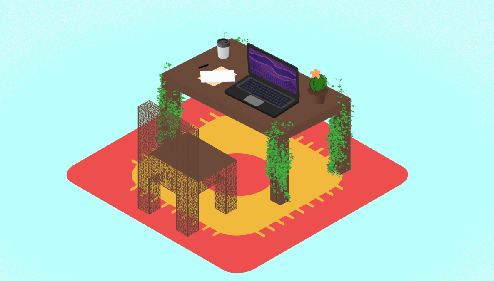

## Art 🎨🖌️

This is where my art collection will reside since I took down my old website, which contained some of my art pieces.

I mostly do vector, isometric vector, or 3D art, but I sometimes dive into other categories like pixel and digital rasterized art.

Without further ado, I will start posting my art!

### 3D

This one was made in Blender with the synthwave sun made in illustrate, so I had to compose it in Photoshop with the effects

One of my first Blender animations and models! I think I followed a tutorial for the wormhole but the TARDIS was modelled by me.

### Animations

<iframe width="560" height="315" src="https://www.youtube.com/embed/AJ4S-1067gc" frameborder="0" allow="accelerometer; autoplay; clipboard-write; encrypted-media; gyroscope; picture-in-picture" allowfullscreen></iframe>

The background was made in Cinema 4D while everything else was composed in after effects. The spaceship was made in illustrator and the music is Text Me Records by Bobby Renz

<iframe width="560" height="315" src="https://www.youtube.com/embed/c-YdjWh7LDA" frameborder="0" allow="accelerometer; autoplay; clipboard-write; encrypted-media; gyroscope; picture-in-picture" allowfullscreen></iframe>

This was from my first game jam! The recording is just the menu for the Unity game and I did the music in FL studio 🎶!

### Vector

One of my earliest vector background images

One of my proudest creations to date, [a spherical cow](https://en.wikipedia.org/wiki/Spherical_cow)!

### Iso Backgrounds

My newest background image. Mostly made within illustrator except the desk which was made in Blender with the ivy addon 🌱

A isometric island made in illustrator

### Other

This is my GitHub avatar that was made in [Mandelbulb3D](https://www.mandelbulb.com/2014/mandelbulb-3d-mb3d-fractal-rendering-software/), a 3D fractal (called mandelbulbs) generator! The theory behind fractals is that they are a self recurring image of themselves at different scales.
