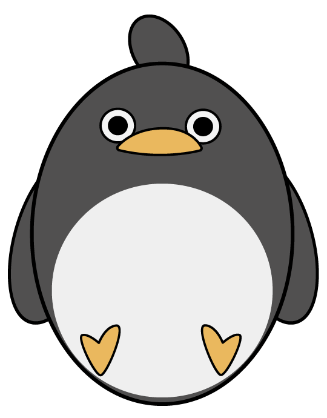

## More Art

Shorter post today but I made some more art today:

This is my avatar and is bigly inspired by [からめる](https://www.youtube.com/channel/UCpGk56cJDZcVqIxZatX7nbQ) YouTube channel in which these penguins always end up in a disastrous mayhem. Highly entertaining stuff to be honest!

My other piece of the day is the is for me emoji

Clearly this is not a faithful recreation but I based it off of [Tren Black](https://www.youtube.com/channel/UCSSBvqWNPq_qO3_W4EJiOAA)'s [Data Structures and Algorithms in 15 Minutes](https://www.youtube.com/watch?v=oz9cEqFynHU) video thumbnail. He makes great stuff for programmers, so check him out if you are interested.

That's all for now folks,

\- Andrew