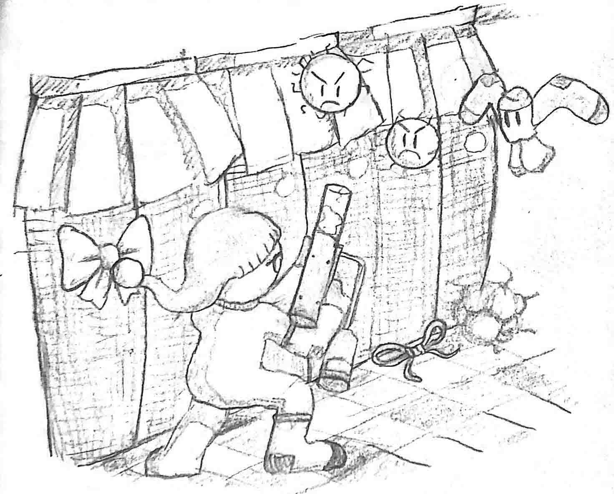
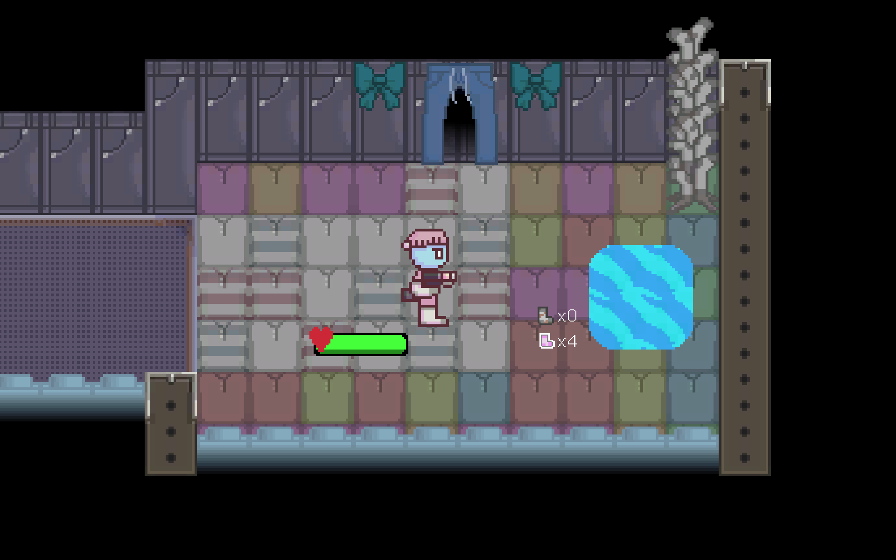
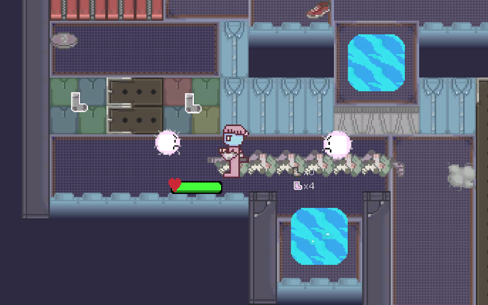

## Update February 4

Well, I've been busy since the last update including several midterms and going out every day since the start of the week in this cursed plague. Anyways what I have an important update about is about the global game jam that took place January 29 to 31! In this game game, I formed a group with 3 other people and worked on a 2D shooter game. You can play it now here: [andrewli.itch.io/socks-and-found](https://andrewli.itch.io/socks-and-found) or view the source code here: [github.com/Zeyu-Li/Socks-and-Found](https://github.com/Zeyu-Li/Socks-and-Found)

Logo I made ^

Cover art made by a lovely team mate

Screenshot 1

Screenshot 2

That's all for now folks

\- 💖Andrew