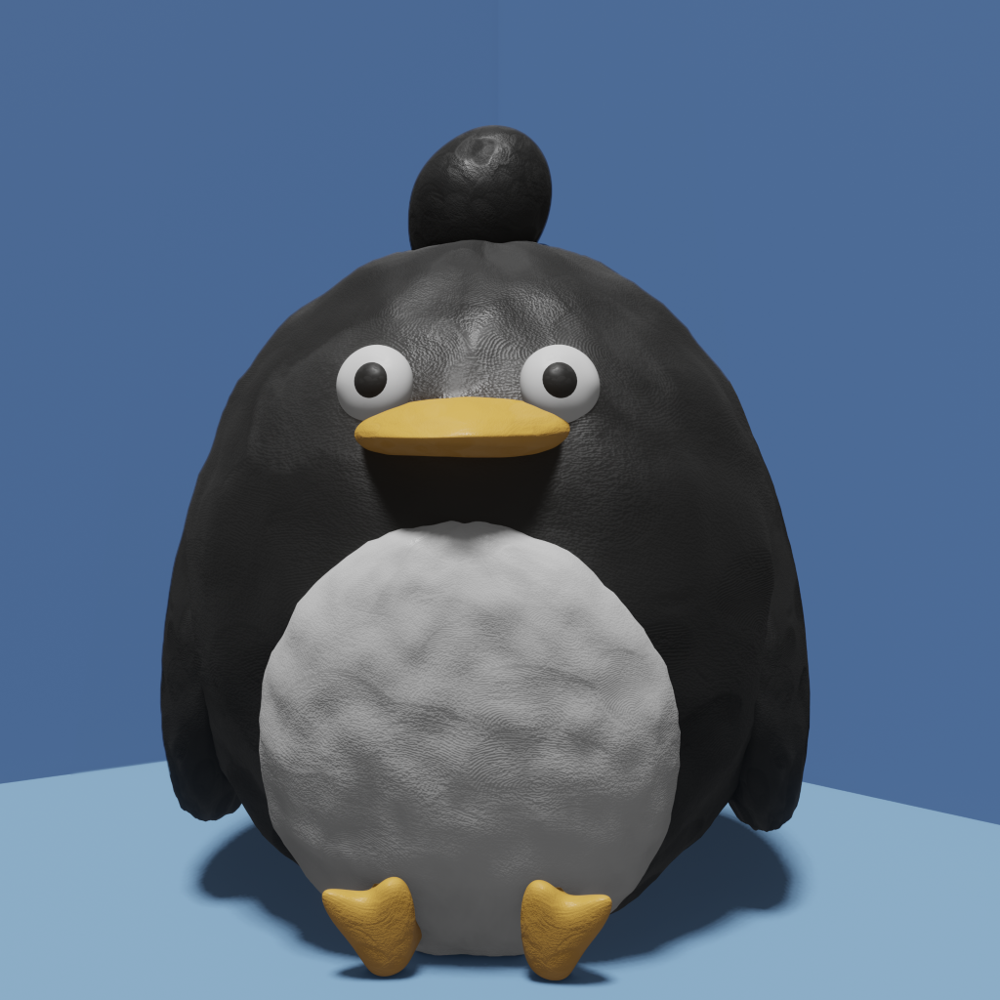
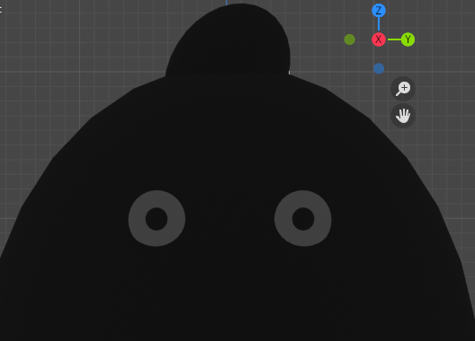
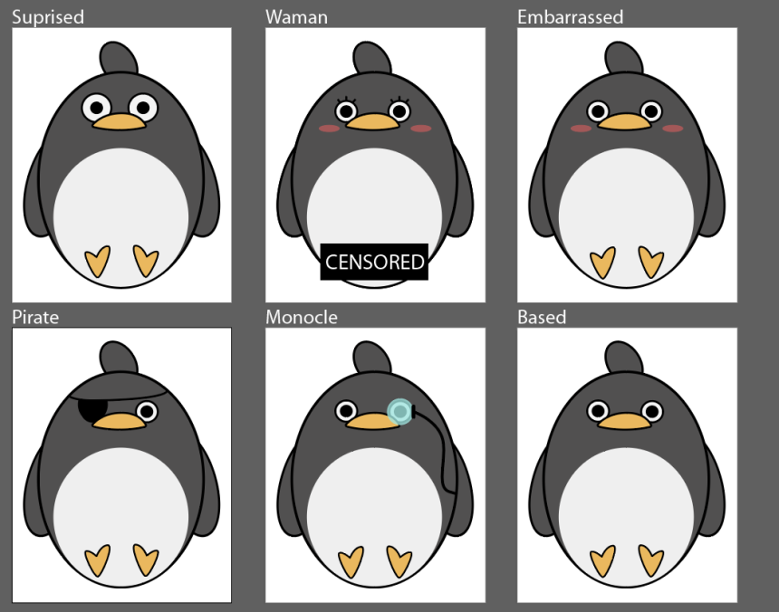

## More Art

This time about me!

I tried to make a 3D stop motion like penguin based on my avatar in Blender and here it is:

I tried to be as close as I could to the original. I followed this tutorial to get the right clay material: [youtube.com/watch?v=wTu3Xssw67Q](https://www.youtube.com/watch?v=wTu3Xssw67Q). In addition, I have screenshot during my process when I disabled all the lights

\:p Imagine finding under your bed at night! What would you do?

I also made different vector variations of me:

Thanks all for now from your lovable penguin,

\- Andrew