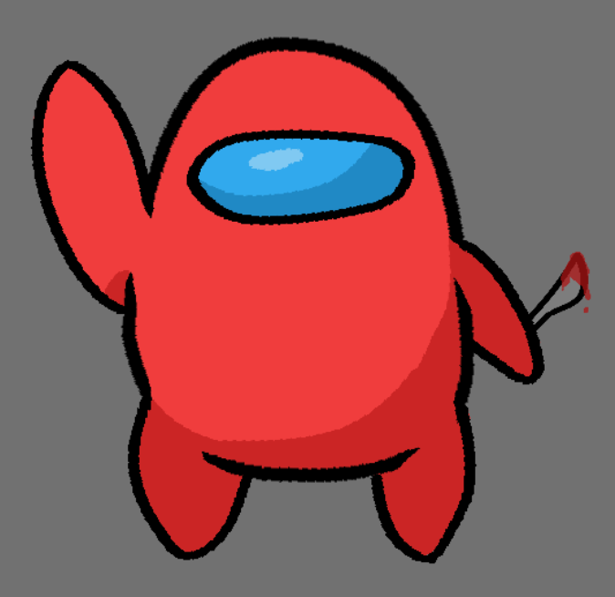

## A Great Success 🎉

Recently I made my first NPM package and to great success! My first package is a webassembly powered Lua runner in JavaScript/TypeScript. Basically, you can run Lua code from JavaScript or TypeScript. Don't ask me about time efficiency because JavaScript is pretty fast and Webassembly just started it's journey into the online world! 

Currently Lua-runner has  many downloads! 

## Art

It appears that I kind of like digital drawing after recently getting into it. Nothing spectacular, but as a first piece, I think it's great! 

## Music

Made a track for either the main theme or title screen for my advanced Unity tutorial. 

**Currently not working :(, see [github.com/Zeyu-Li/Unity-Advanced-3D-Tutorial/blob/master/Assets/Music/main.wav](https://github.com/Zeyu-Li/Unity-Advanced-3D-Tutorial/blob/master/Assets/Music/main.wav)**

<audio controls>
  <source src="../assets/img/main.wav">
  Your browser does not support the audio element.
</audio>

