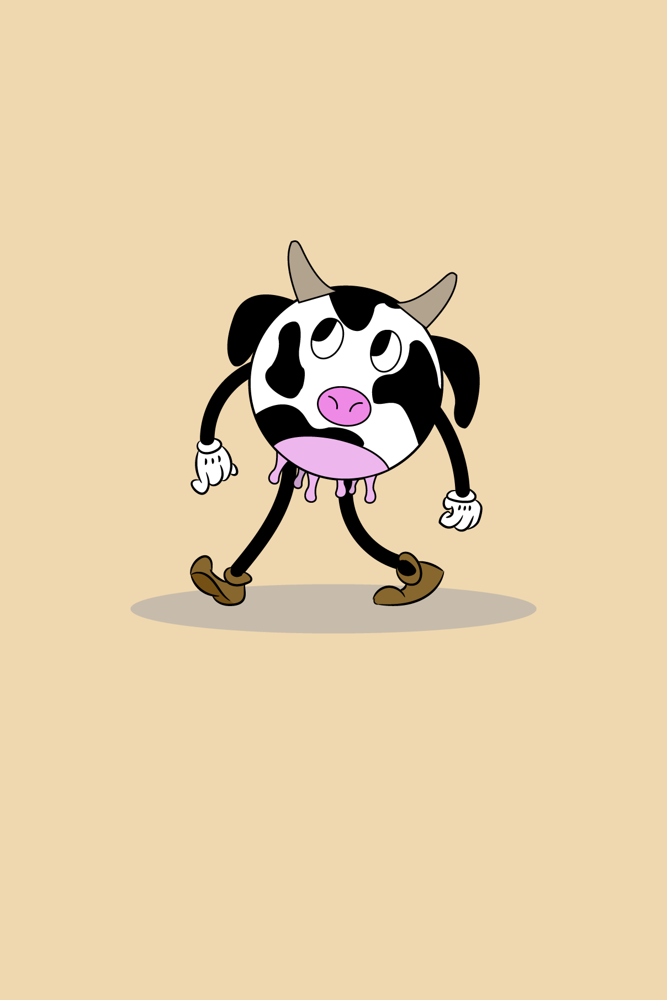
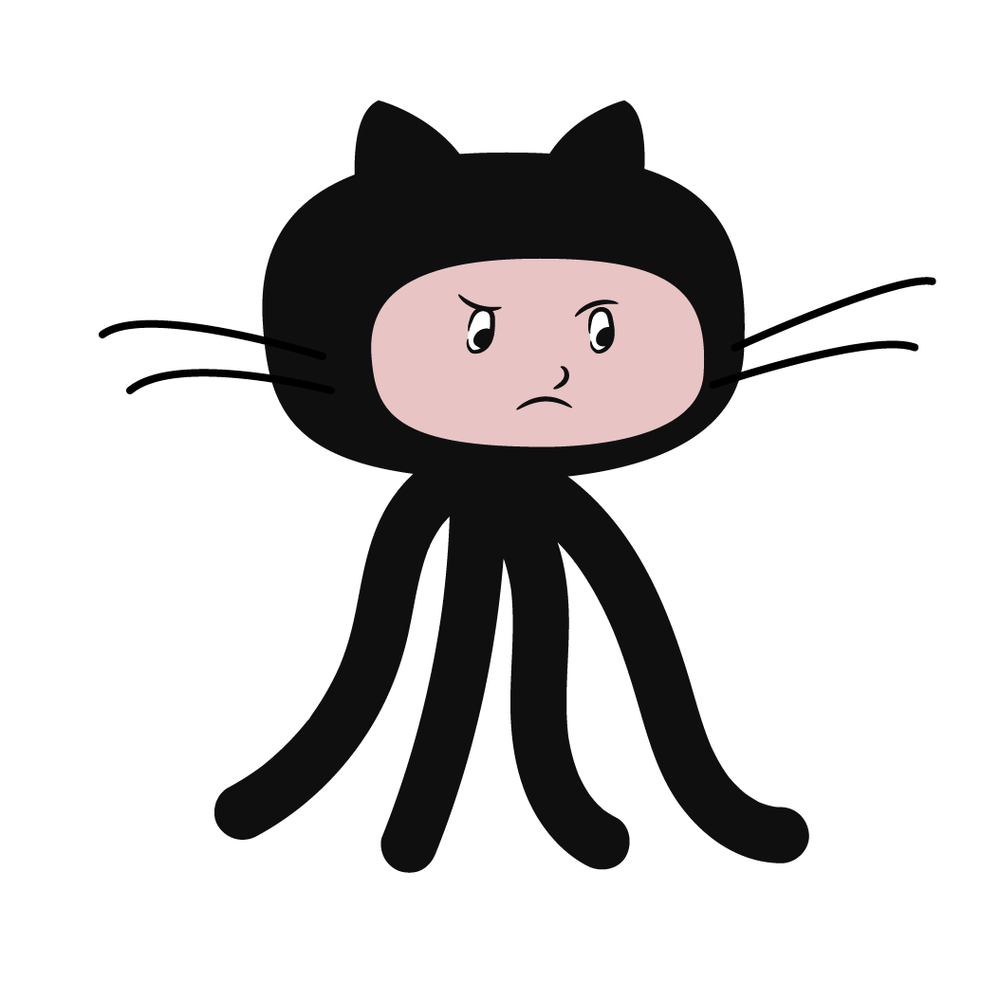
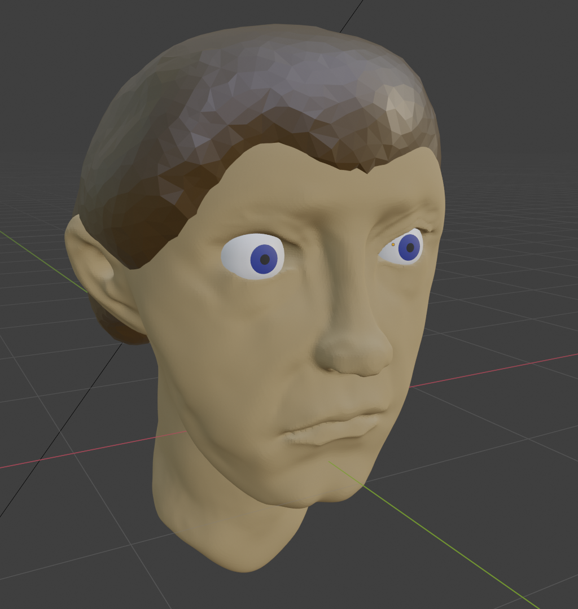

## 👋 Hey, it's been a while

It's been 20 days since the last update and that's due to finals season and partly stacking off. However I did not do nothing during that time - I've made more art. This time I've experimented with different styles by learning from tutorials

This first one is my classic spherical cow in a cartoon style:

Was made in Adobe Illustrator by following this tutorial: [youtube.com/watch?v=KTh925hn6Yk](https://www.youtube.com/watch?v=KTh925hn6Yk)

The next one is just an octocat doing the following emoji 🤨

The final art piece is my first attempt in sculpting in Blender:

Mostly followed this tutorial: [youtube.com/watch?v=HTgUyEHnKso](https://www.youtube.com/watch?v=HTgUyEHnKso)

\+ this one for hair: [youtube.com/watch?v=f-mx-Jfx9lA](https://www.youtube.com/watch?v=f-mx-Jfx9lA) 

That's all for now... I need to get back to studying for finals 😫

## **👋 Adios**
