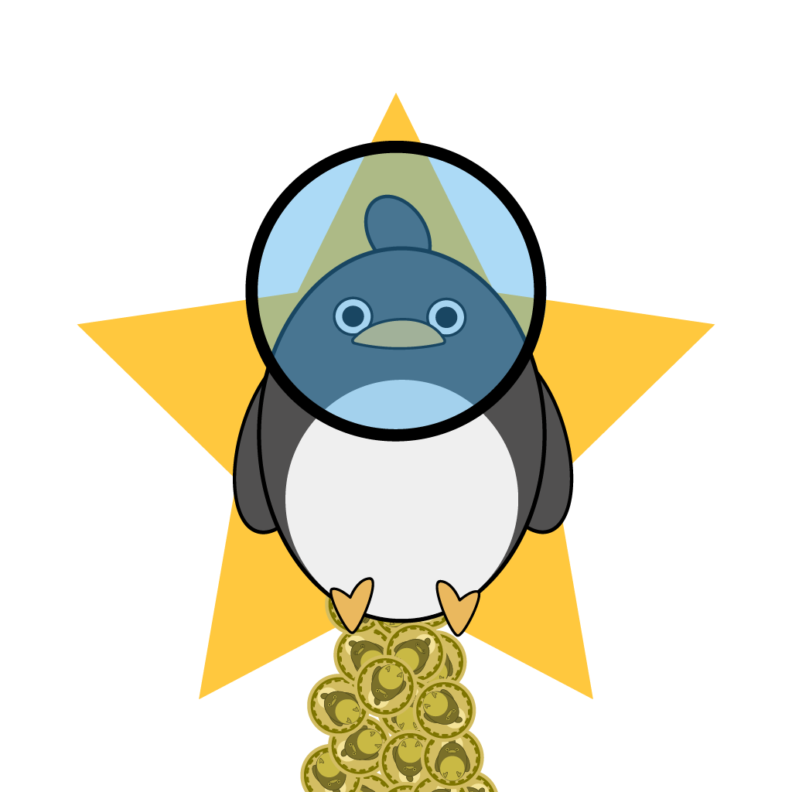

## ART GALORE

Wow what a busy week it has been. Aside from release the first version of the app for my job, I also finished a lot of things I have wanted to do/finish. In no particular order they are:

### Bottom Penguin

A basic crypto currency in Python: see [GitHub](https://github.com/Zeyu-Li/bottom-penguin)

### Finishing the Unity 3D Advanced game tutorial

See [GitHub](https://github.com/Zeyu-Li/Unity-Advanced-3D-Tutorial) or play it now with the [WebGL version](https://andrewli.itch.io/unity-advanced-tutorial)

Here are some snapshots:

### Making Penguin Space 

When penguins go to space, we ask you to join the space penguin galactic empire 

### Looking forward

Well it seems like an exciting time, not only for me but for a lot of other tech related things. One thing that I excited for is finally using the Geometry nodes in Blender. This [video](https://www.youtube.com/watch?v=E2wVTGzSwpg) has got me excited especially. Other than Blender, Windows has a new update with a big UI overhaul, but I am most excited about the windows package manager and GUI apps in WSL2! 

#### End

Well all this is thanks to upgrading from 8GB to 16GB ram on my laptop 🥳

That's it for now, take care and don't forget about your shots and to the moon we go

