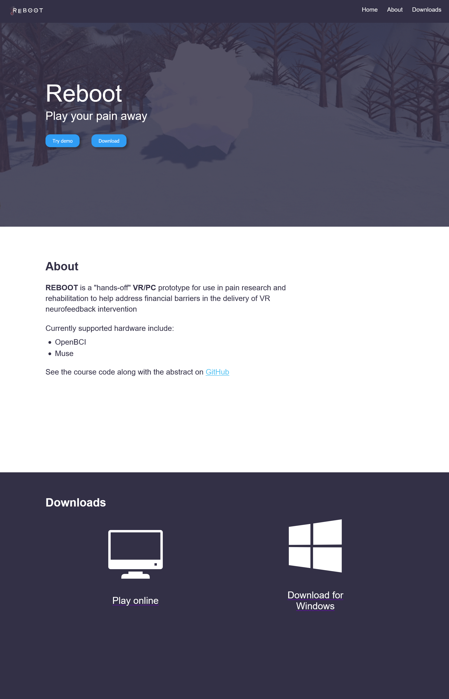

# Winner Winner Chicken Dinner

Wow I never thought this day would come but I won a hackathon (and a non-trivial one)!!

This past long weekend I partook in [natHACKS](https://nathacks.devpost.com/), a 64 hour hackathon hosted by NeurAlbertaTech with 10k in prizes. My team of 5 called Manic Brains won first place in the research stream 🎉!!! This was a fun project that I unfortunately did not understand the full complexities because I mostly worked on the software dev side of things since my knowledge on neurotech approaches 0 😅. For winning the stream/track we are given 2k seed money to take this product/idea further 🤩. If you want to learn more about the project check our our [devpost](https://devpost.com/software/reboot-0eyc7p) on the project or check out the [website I made](https://rebootgame.vercel.app/)

I had a great time with my team members and loved working on the project from a technical view. I'm most proud of the website.

Take note that the image at the top is actually a gif demoing the product

If you want to take a look at the source code you can click [here](https://github.com/Zeyu-Li/Reboot)

~ That's all for your little penguin today, have a good day!

PS the leetcode grind is still going and I'm close to 100 👀