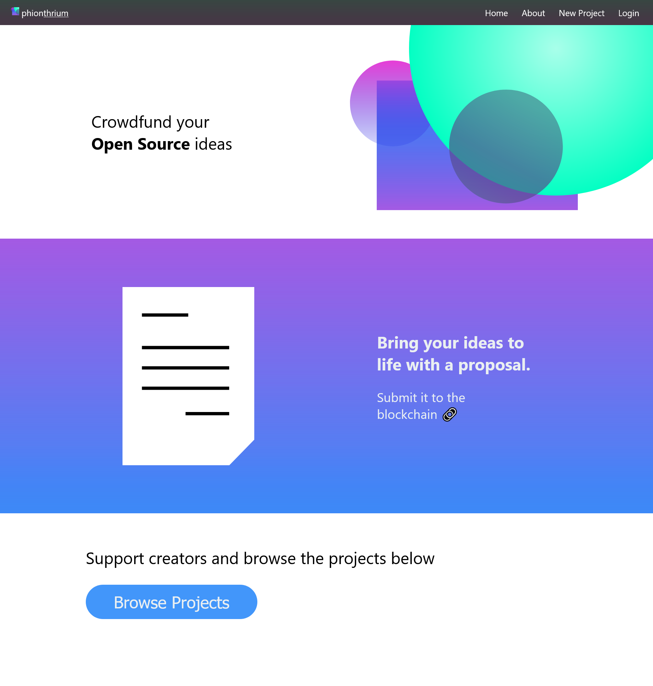

# Hack the North

Well Hack the North happened and it didn't go so well 😳. Let's just say someone in our group didn't show up. Otherwise it wasn't too bad other than hackathon semantics like not being feature rich and being crushed on time. Our project phionthrium is a way (website) to crowdfund open source software using smart contracts. You can explore the website [here](https://phionthrium.vercel.app/) but I think I will disconnect the backend soon. The aesthetics for the front end look cool, but other than that it's a bit feature incomplete.

View some screenshots [here](https://github.com/Zeyu-Li/phionthrium) and I have provided a single one here:

## Updates

Other than the hackathon, school has started and hits like a truck like always, although I still got time to make art like this one

Made with Blender than imported output to Illustrator to be be vectorized and shaded

This one is pretty good so I might replace my avatar everywhere with this, we shall see uwu

---

Thanks for reading and hope u have a great day <3

PS I found that C418 made a new album (cookie-clicker) and it's a popper: [c418.bandcamp.com/album/cookie-clicker](https://c418.bandcamp.com/album/cookie-clicker)