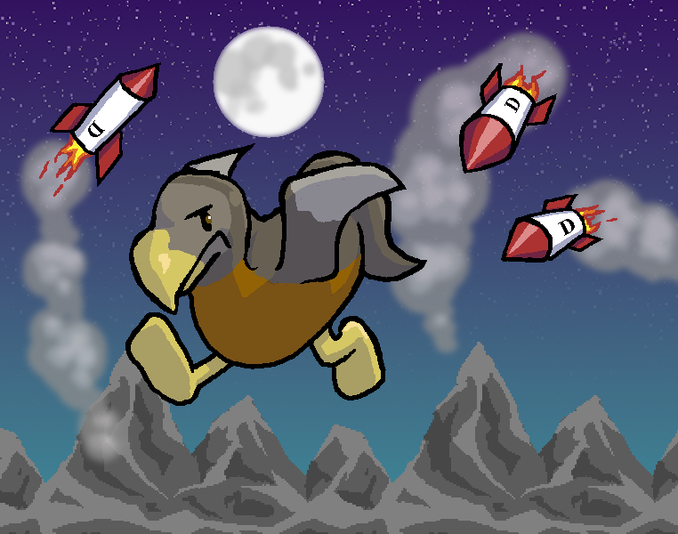

# Update November 7

👋 Hey there, it's been a month and I have been so very busy. The most recent project I completed was the game jam this week where I completed *The Last Dodo*. You can play it here online even: [struckdown.itch.io/the-last-dodo](https://struckdown.itch.io/the-last-dodo)

[](https://struckdown.itch.io/the-last-dodo)

This was a exciting game jam, had lots to do but finished early. I finally used something I learnt at school (😅) which was using simple rule based systems for emergent behaviours. This was also my first time using Godot!

Other than making this fun game, I had lots of my plate thanks to working two part time jobs and more side projects. \

I will now go thought some of my side projects now.

### UwULang

My first side project is a Brainfuck clone, but instead of using simple ascii characters, I used emojis so  something like

```bf
++++++++[>++++[>++>+++>+++>+<<<<-]>+>+>->>+[<]<-]>>.>---.+++++++..+++.>>.<-.<.+++.------.--------.>>+.>++.
```

It would be like this

```uwulang
👆👆👆👆👆👆👆👆😒👉👆👆👆👆😒👉👆👆👉👆👆👆👉👆👆👆👉👆👈👈👈👈👇😡👉👆👉👆👉👇👉👉👆😒👈😡👈👇😡👉👉🥺👉👇👇👇🥺👆👆👆👆👆👆👆🥺🥺👆👆👆🥺👉👉🥺👈👇🥺👈🥺👆👆👆🥺👇👇👇👇👇👇🥺👇👇👇👇👇👇👇👇🥺👉👉👆🥺👉👆👆🥺
```

To learn more see [github.com/Zeyu-Li/uwulang](https://github.com/Zeyu-Li/uwulang) for the Python and the C interpetor otherwise use [github.com/Zeyu-Li/uwufier](https://github.com/Zeyu-Li/uwufier) to transpile Brainfuck to UwULang

### Bottom Penguin Coin

The next side project I want to talk about is my Bottom Penguin Coin website. What started as a meme with me wanting to learn blockchain turns into a real project I have been working on for fun. This part is the website with cool 3D animation and tailwind (css library)

Find out more here [github.com/Zeyu-Li/bottom-penguin-coin-website](https://github.com/Zeyu-Li/bottom-penguin-coin-website) or view the website in full here [coins.andrewli.site](https://coins.andrewli.site/)

### Overleaf/KaTeX

The final project I want to talk about is a series of projects involving KaTeX/LaTeX. Most of these projects involve learning a new web framework. For my LaTeX to KaTeX converter I learnt Vue [[Zeyu-Li/latex-katex-converter](https://github.com/Zeyu-Li/latex-katex-converter)] and for the Overleaf clone I learnt Angular [[github.com/Zeyu-Li/overleaf-lite](https://github.com/Zeyu-Li/overleaf-lite)]. These projects are all live thanks to vercel so click on the GitHub links then the website link to see a live demo

### Misc

Other than that, I have been working through a ton of kattis problems and I an doing a week long hackathon!

## Thanks

Thanks for reading this blog post and I will keep you updated for the future...


\- Your Lovable Penguin 🐧 


Andrew

P.S. Might post next month 🙏

