## Art Portfolio 🎨🖌️

My art portfolio all in one place!

I mostly do vector, isometric vector, or 3D art, but I sometimes dive into other categories like pixel and digital rasterized art.

Without further ado, I will start posting my art!

### 3D

This one was made in Blender with the synthwave sun made in illustrate, so I had to compose it in Photoshop with the effects

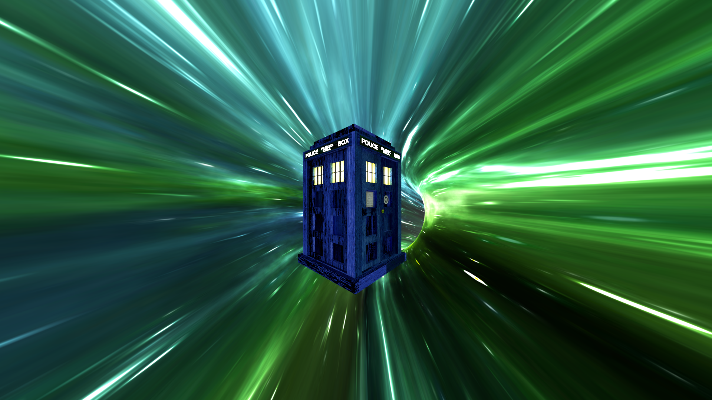

One of my first Blender animations and models! I think I followed a tutorial for the wormhole but the TARDIS was modelled by me.

### Animations

<iframe width="560" height="315" src="https://www.youtube.com/embed/AJ4S-1067gc" frameborder="0" allow="accelerometer; autoplay; clipboard-write; encrypted-media; gyroscope; picture-in-picture" allowfullscreen></iframe>

The background was made in Cinema 4D while everything else was composed in after effects. The spaceship was made in illustrator and the music is Text Me Records by Bobby Renz

<iframe width="560" height="315" src="https://www.youtube.com/embed/c-YdjWh7LDA" frameborder="0" allow="accelerometer; autoplay; clipboard-write; encrypted-media; gyroscope; picture-in-picture" allowfullscreen></iframe>

This was from my first game jam! The recording is just the menu for the Unity game and I did the music in FL studio 🎶!

### Vector

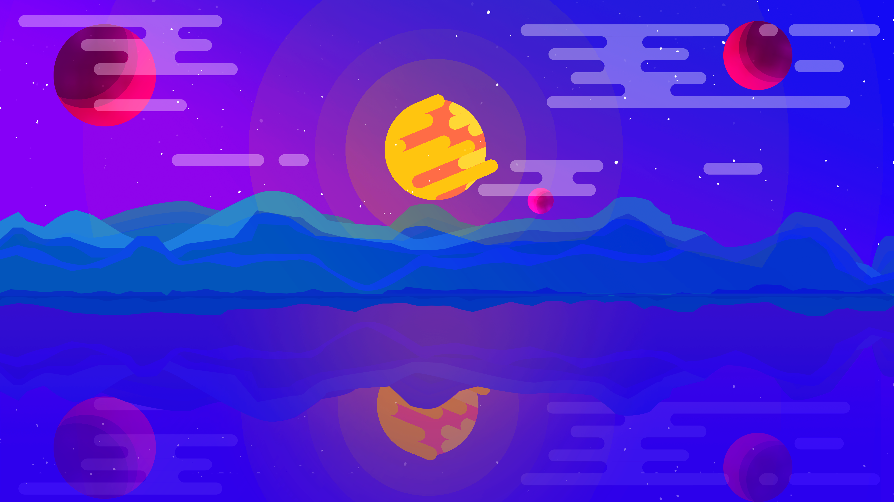

One of my earliest vector background images

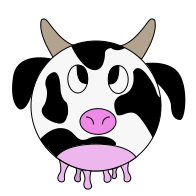

One of my proudest creations to date, [a spherical cow](https://en.wikipedia.org/wiki/Spherical_cow)!

### Iso Backgrounds

My newest background image. Mostly made within illustrator except the desk which was made in Blender with the ivy addon 🌱

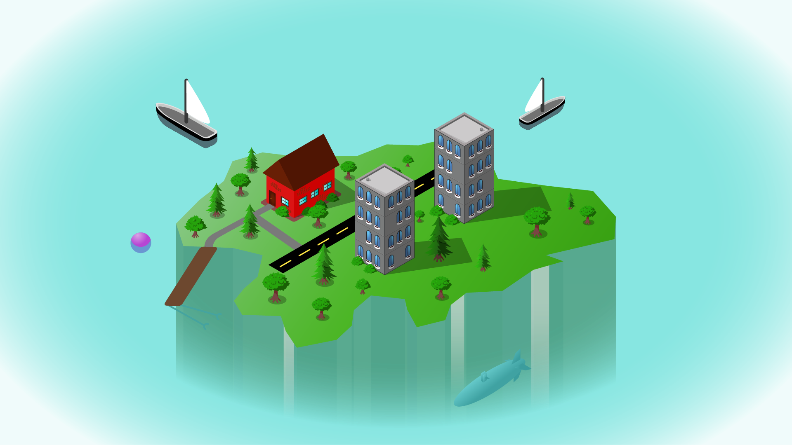

A isometric island made in illustrator

### Other

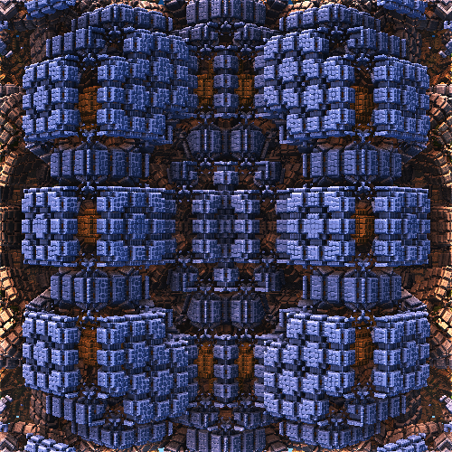

This is my GitHub avatar that was made in [Mandelbulb3D](https://www.mandelbulb.com/2014/mandelbulb-3d-mb3d-fractal-rendering-software/), a 3D fractal (called mandelbulbs) generator! The theory behind fractals is that they are a self recurring image of themselves at different scales.

### Penguins

Some people ask why I have so many penguins, the question for you is why don't you have this many penguins?

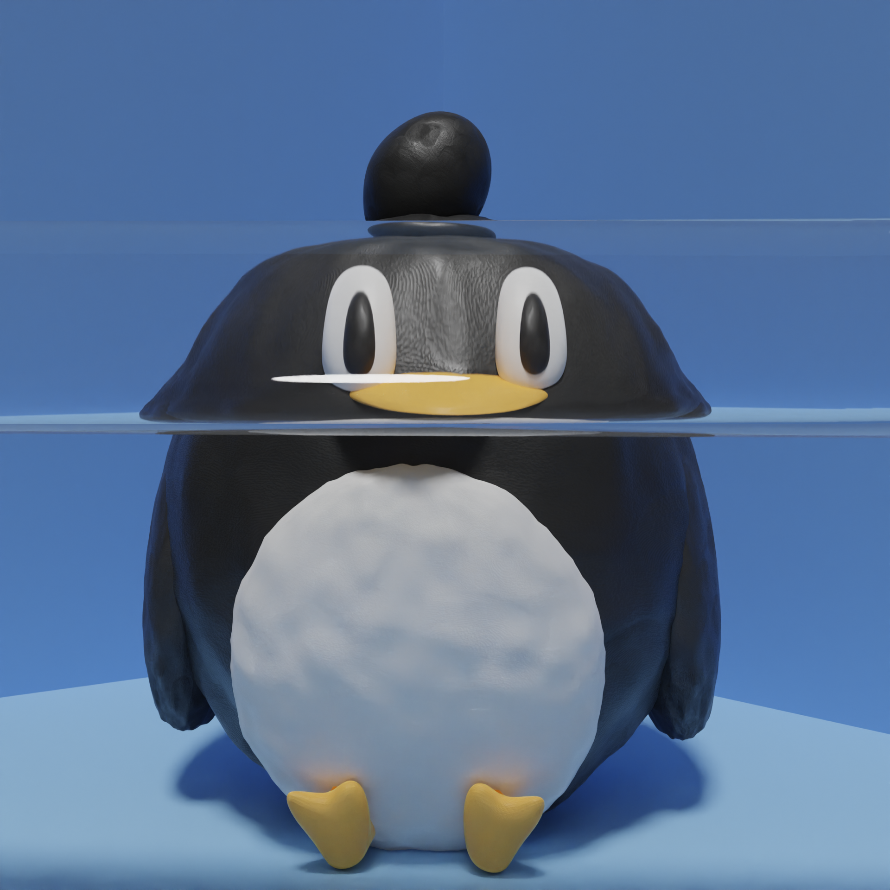

Penguin looking through a glass tube inspired by this cat: [reddit.com/r/hmmm/comments/ppwrr6/hmmm/](https://www.reddit.com/r/hmmm/comments/ppwrr6/hmmm/)

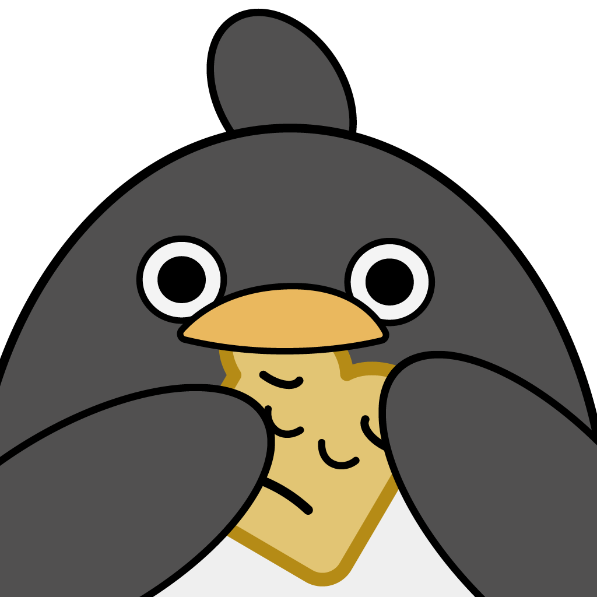

Penguin eating UwUbread

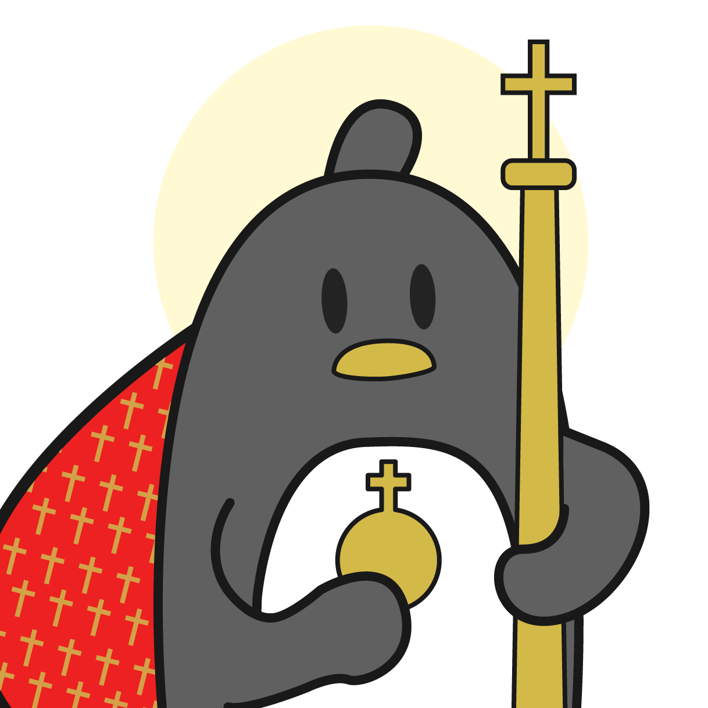

Penguin dressing up for Christmas

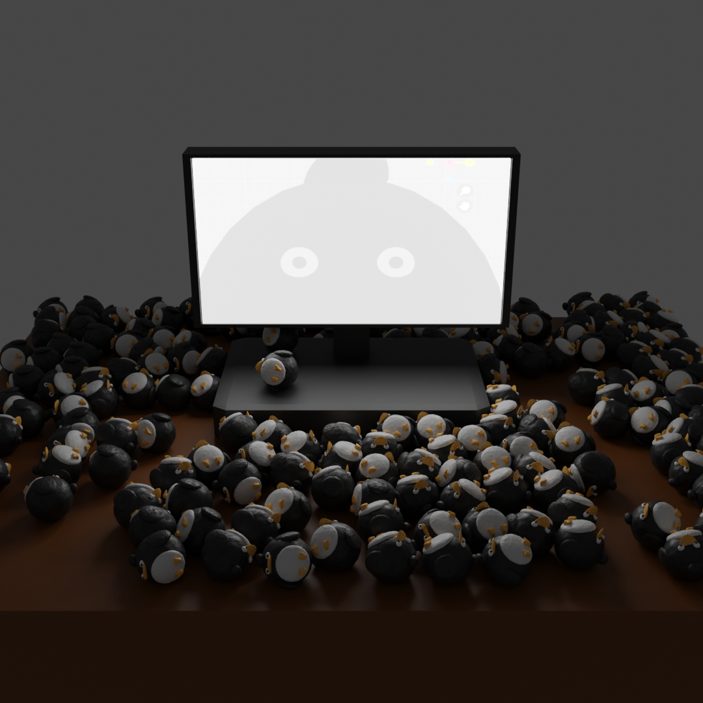

Many many penguin hours later

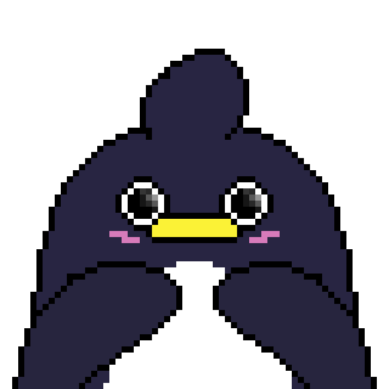

😳👉👈

Hello there

Penguin is empty inside - inspired by [reddit.com/r/Kirby/comments/m4pccr/water/](https://www.reddit.com/r/Kirby/comments/m4pccr/water/)

First day of school

Penguin going to the moon🌑

Penguin after his first Blender tutorial

Penguin finally in space

### Other drawings

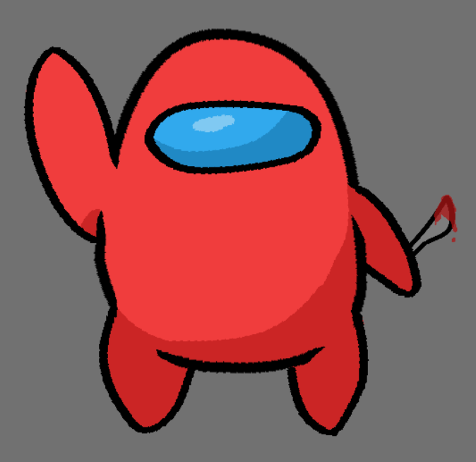

Pretty sussy guy
