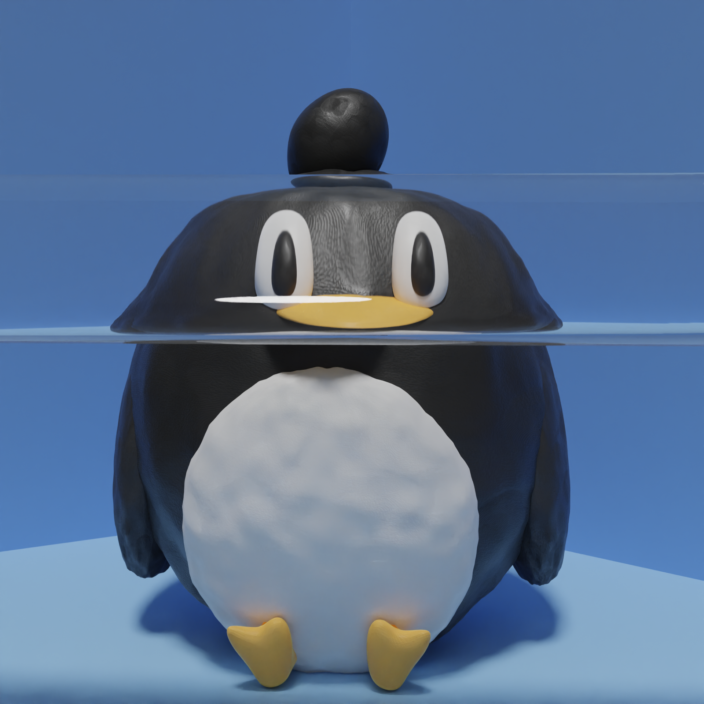

## April Update

Hi folks, it's already a quarter way through the year 😳so probably best to give an update. Additionally it is my birthday this month so yet another revolution around the sun while I wasn't awake! 

### Job

Currently have a good time at Intuit and looking forward to actually going in person in May. This will be my first time in the office and I am so excited to finally meet some people in person rather than on zoom. From the posts on Slack I see some very exciting events going on in the office so far that I wasn't part of so it is my destiny to partake in those fun events soon. 

In addition to the main job, I'm gonna start a business for my freelancing mostly, so that will be exciting since I have much to do and I'm excited for what comes next! Currently looking ahead and trying to get some freelancing clients under my company so if you know anyone, [📞me](mailto:hello@andrewli.site)

### Projects

Don't worry about projects, I still going on those but at a slower pace now because of all the other things I am doing

#### Create a Business

Since I am going through the motions of creating a business, I feel like it's my duty to create a doc for others (and future me 😳) to follow when creating a business

Link: [zeyu-li.github.io/create-your-business](https://zeyu-li.github.io/create-your-business/)

Source: [github.com/Zeyu-Li/create-your-business](https://github.com/Zeyu-Li/create-your-business)

#### Freelancing site

Created a freelancing site but will probably replace it with one under my company

Live link: [freelancing.andrewli.site](https://freelancing.andrewli.site/)

Source: [github.com/Zeyu-Li/freelance](https://github.com/Zeyu-Li/freelance)

#### Figma Docs

Created a massive doc for using Figma (I will now use it as a design language for documenting things in the future)

See [github.com/Zeyu-Li/figma-docs](https://github.com/Zeyu-Li/figma-docs)

### Kudos

Thanks for getting through my blog post 👋

Haven't made any art since the last update post but I will rectify that soon hopefully

In the meantime, enjoy this art piece I did before the last post with slight modifications:

