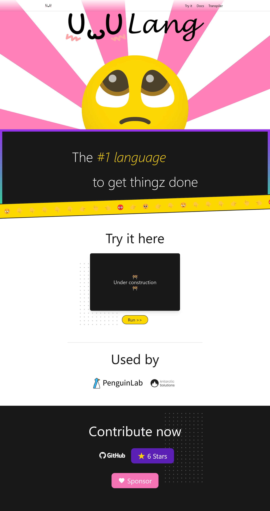

# UwULang

Recently finished polishing, UwULang, the \#1 language for getting things done 😾

More info can be found on the website: [uwulang.com](https://uwulang.com/)

The website didn't take too long to complete, only the animations taking longer than ½ the time in coding it. I consider it my magnum opus of design as of now even though it took maybe 4-5 hours to code up and a few hours of refinement later. Here is a screenshot of what it looks like, although it is missing animations. In addition some parts are not completed (like the Try it here section)

[](https://uwulang.vercel.app/)

Right now I am still working on setting up the docs and having an inline interpreter in JavaScript. In addition I am setting up a sponsor link for it.

UwULang itself is actually a turing-complete language modelled after the measured UwUness of a programming language called BrainFuck. To see the full specification see [github.com/UwULang/uwulang/blob/main/uwulang.md](https://github.com/UwULang/uwulang/blob/main/uwulang.md#uwulang-specification)

To give a brief overview, UwULang has 8 basic instructions:

* 👆 \- increment
* 👇 \- decrement
* 👉\- go right
* 👈\- go left
* 🥺\- print char
* 😳\- get char
* 🥴\- random short
* 😒\- jump to 😡if curr == 0
* 😡\- jump back to 😒 if curr != 0

To run hello world you would have to do

```uwu
👆👆👆👆👆👆👆👆😒👉👆👆👆👆😒👉👆👆👉👆👆👆👉👆👆👆👉👆👈👈👈👈👇😡👉👆👉👆👉👇👉👉👆😒👈😡👈👇😡👉👉🥺👉👇👇👇🥺👆👆👆👆👆👆👆🥺🥺👆👆👆🥺👉👉🥺👈👇🥺👈🥺👆👆👆🥺👇👇👇👇👇👇🥺👇👇👇👇👇👇👇👇🥺👉👉👆🥺👉👆👆🥺
```

Check out the original implementation in C: [github.com/UwULang/uwulang](https://github.com/UwULang/uwulang)

## ✌️


