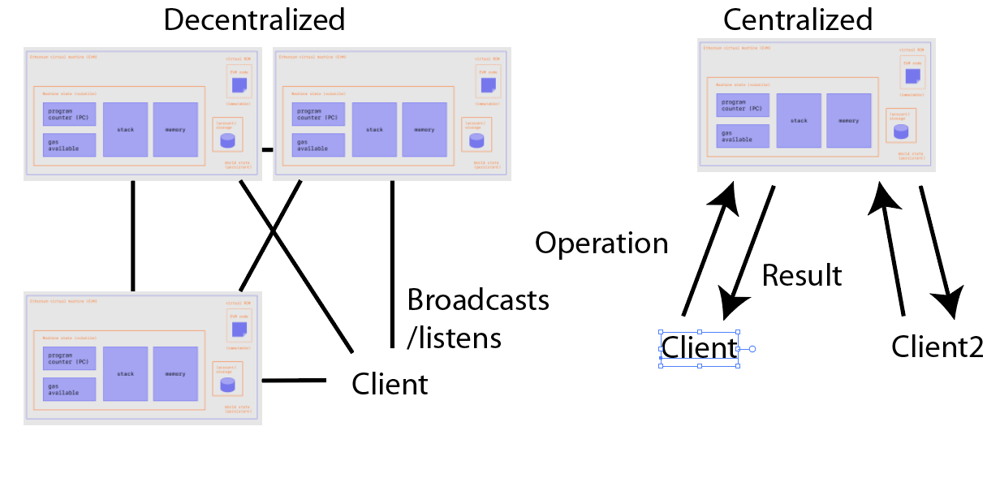

Crypto and blockchain are digital technologies that have gained immense popularity in recent years but with very few use cases, especially non-financial ones. They are based on the principles of supposedly "decentralized" systems and cryptography, which allows for "secure" and "transparent" transactions without the need for intermediaries. The crypto community has hailed crypto for it's

1. Decentralization
2. Security
3. Anonymity
4. Limited supply

In this blog post we will break down these values one by one.

## Decentralization

Fundamentally, crypto is not standing on solid ground. Cryptocurrency as a distributed system is just one big DB built with no hard deletes. Using the CAP theorem for DB (can have 2 of 3), consistency, partition, and availability, we can identify that most implications of blockchains have consistency and partition, but availability is really lacking. Given this, it is fundamentally hard to scale as compared to a centralized system as a lot more resources will be needed to add another row to the system. In trying to reconcile these challenges there are many projects trying to over engineer a solution to make it faster when a very obvious solution exist if we don't assume decentralization. Another form of this over engineering would be to look at how many connections you need to maintain to keep the system going.

For a decentralized system we would need to keep approximately $n^2$ connections to keep open. For a centralized system we only need to maintain $n$ connections (example RTC). Clearly as systems grow, one will grow exponentially in resources required and one will scale linearly.

In addition, the whole space is not very decentralized as most people use an exchange and are in the same mining pool. Also consider the fact that most implementations have a genesis block that favours the creators very generously. This is not the making of a fair system and has all the markings of a capitalist system trying to hammer an increasing amount of inequality and capital accumulation. The reliance on centralized exchanges, the centralization of mining power, and the concentration of wealth and power in the hands of early adopters all create risks and undermine the potential benefits of these digital "assets" (more like liabilities).

## Security

Just look at the fall of FTX and the other crypto funds. Additionally, I think a lot of people are delusional into thinking if it's virtual, it's untouchable, however the users exist in the physical world where any form of physical intimidation is enough to break in.

## Anonymity

Anonymity is not a thing, every transaction is public and people can easily track you, in fact, entities like the government with large and expansive surveillance networks apparatuses can easily tell who is who. This is because not only the date is recorded but the amount so you can derive a lot of info from that. If we consider a crypto where everything is anonymized, the government will still be able to find you (as their resources vastly outnumber you). In fact, they will use the same tactics to catch money launderers as value will have to flow from one form to one thing you want. This is not even considering that a majority just use a centralized exchange.

## Limited Supply

Not much to say here except it plays into the hands of power/capital concentration in the few.

## Future Evolution of Crypto

The way these laissez faire systems work is that they eventually evolve into the late stage capitalism that these people complain about and power/money concentrates in the hands of a few, i.e. look at all those who are piling in (capitalists like Kevin O'Leary and quant funds). It will end up like 2008 again just like the creators feared. The solution isn't working within the system to create more structures of inequality, a new equitable system should be created instead!

## Other

I'll just be honest - it's been 14 years since cryptocurrency was created (first transaction of Bitcoin) and we have not seen any profound uses other than for financial transactions (and not very well at that).

## Conclusion

The issues supposedly solved by cryptocurrencies are entirely made up and a solution was manufactured before any questions were asked. If we wanted a transparent system with checks and balances, a government run financial institution with strict privacy and transparency would be massively better. Of course this would entail a democratic governance instead of a corporatocracy like we see today. In addition, improving institutions where sending money is easy and frictionless such that one can send money anywhere with little or no fee. If private businesses were removed from these operations and an international operator runs with no profits, sending money would not be an issue.

### Disclaimer

I still believe in crypto but those are very niche use cases and research into it should be encouraged but believing it will go to the moon is a delusion. I also think that in fact crypto will go to the moon in the next hype cycle but that's because as debt is easy to finance and cash supply increases, everyone will be looking for the next 10x and the crash/hype cycle perpetuates, especially with the masses of (mostly business) people proclaiming "I'm just temporarily poor, I will be a rich capitalist someday" copium. Even so, I am confident that the use cases for crypto will still be similar to what is available now (ie no breakthroughs)
