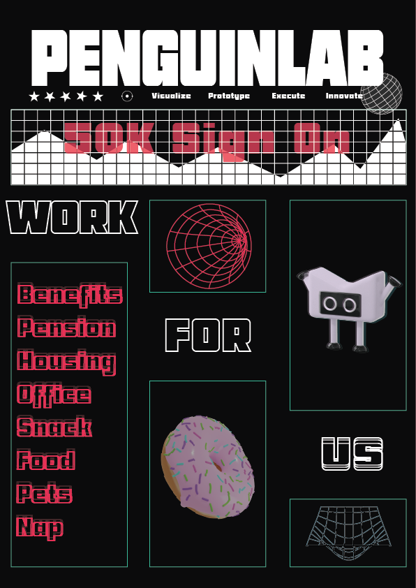

Well, well, well, it looks like my internship has started and it has been more hectic than ever, I will have done 3 separate week long hackathons for work. I don't know if hackathon driven development is a thing but I assume it's possible. Jokes aside, HDD is not normal but I am excited to be on the "metaverse" futures (R&D) team at Intuit. Such a fun team with lots of senior people and working with very cool and cutting edge tech, including LLMs like GPT 4 and langchain. I hope this excitement never ends! As we climb closer and closer to the peak of AGI and superintelligence, things will get more exciting. 

Going forward I also wonder if I should ask ChatGPT to help me write these blog posts as I have been writing this all myself 🤔. I am so hyped for the future!

## School Life

Thankfully no school as I have decided to drop out of the spring courses as I don't think I can handle the can shortened schedule of spring semesters (2 months long). Hopefully I will still be able to graduate after fall this year but this does put it in question. Nevertheless I am hopeful I just need 1 more semester.

----

Otherwise, enjoy this hypothetical hiring poster I made for a company called PenguinLab

(note the mascot may or may not be a rip of Kotlin's mascot)
