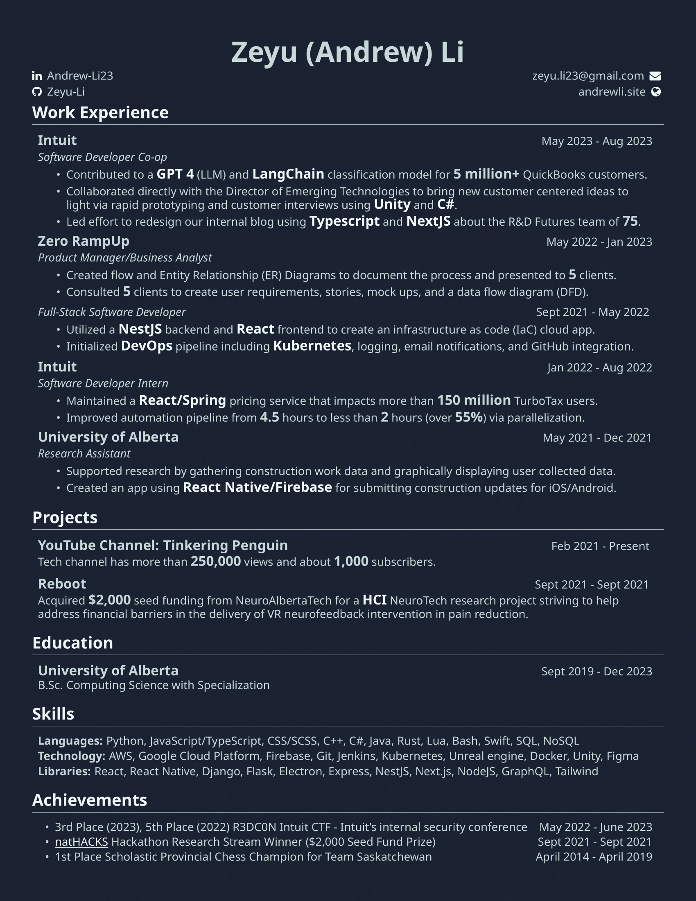

## Into the Metaverse
The Metaverse sure does have a lot of ML and GPT (AKA worse regex). Jokes aside, I am having so much fun working on the team. It's also interesting that a CTF took place during my time there and I got 3rd place (up from 5th place last year). I even received $50 USD for winning + swag! Otherwise I’m just biding my time and finding work like my new vlog styled post on the TinkeringPenguin YouTube channel. 

### Other verse

I watched the new Spiderman and it was amazing. Really recommend such an awesome movie. I also tried a custom awesome/arch setup which made me free like I was living in the future but in the end I couldn’t run Adobe apps so I switched back to Windows 11. Additionally, I couldn’t get GPU passthrough to work on my desktop that I built because it did not have integrated graphics and I couldn’t find an easy way to partition the GPU or pass through the GPU completely but have graphics still on the host machine. 

### School

I’m taking a freebie summer course of Phil 120 which is an easy first level logic course. Should run into no trouble as I still have to work full time fingers crossed. 

### New resume

Check out my new resume which I reference as an art piece. The subtle off white coloring 😂! 

### Thanks
This is my most recent art piece based on the reference below it

Reference:

By this artist: [oritoor](https://www.instagram.com/oritoor/) who also does very interesting poster like designs