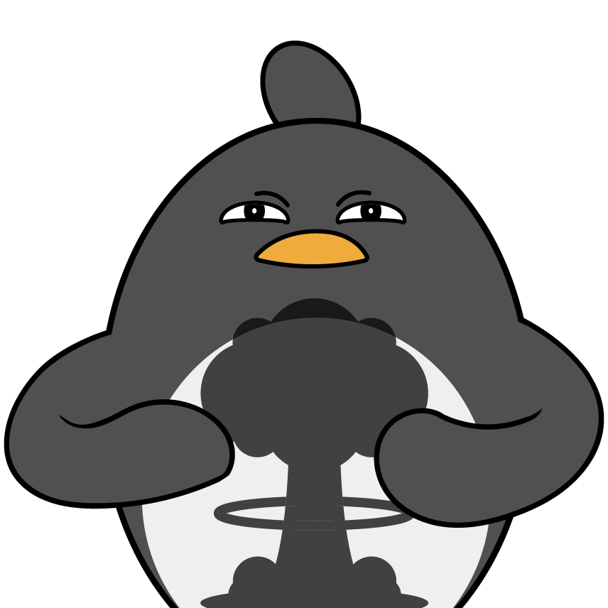

## Journaling
I’ve recently started journaling and it’s been great. I’ve been getting all my thoughts on notion and also organizing my notes (also categorizing inspirations). I believe notion has been one of the greatest tools invented because it is cloud hosted and has multi-media capabilities so I can check out links and images instead of just text based paper notes. Additionally, notion has cool AI capabilities to summarize each day. Maybe I can run it again and have a meta summarizer for a month or year. 

## Relaxing
I can’t believe my internship is almost over as mine ends on August 25th 😱. It came through so fast and ends in a flash. I hope to make a lot of these last few days. Overall it was an exquisite experience and once in a lifetime opportunity. From game development to prompt engineering and ML, I’ve covered a lot of ground in some eye opening experiences! 

## Barbenheimer
Recently I watched Barbie and Oppenheimer and I have to say, they were both slaps. I watched Oppenheimer first and even though it was 3 hours long, it only felt like 1.5 hours. Now Barbie was just pure fun and entertaining. Ryan Gosling was goated and was literally me (jk). 

That’s all for now, this is my art after watching Oppenheimer:

I’ve become penguin, destroyer of worlds.
