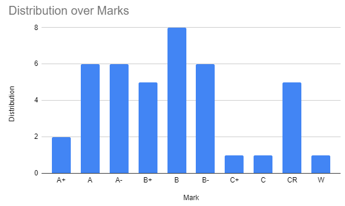
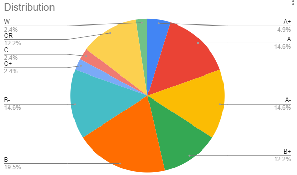

# No More School!!

Well school is over and I've graduated!! I now have a degree although the ceremony for it comes a bit later. What does this mean? Well, no more school which leaves a lot of time to do the other stuff I’ve been meaning to get to! More art, more projects, more everything! Look forward to it and I won’t disappoint in the releases, it’s a promise 🤞. 

## School Review 👏👏

Now I will review all the classes I have taken throughout all my school years. First off, some analytics since I love data. 

This is my mark distribution with a clear normal distribution for CMPUT courses with the mean between A and A- and everything else at a mean around B. (note CR means credit as was used when covid first happened and W means withdrawn. 

Here is another chart to have a percent breakdown in the form of a pie chart. Clearly, I’m not doing the best, I am just an average student as I was not interested in academia and was always pursuing something to the side that kept me distracted from school to the annoyance of my parents. 

## My courses

Now I will go over my courses one by one as I have taken them starting with year 1 semester 1. FYI, there are 2 main school semesters in a school year. One for fall and one for winter but half terms (condensed) in spring and summer.

### Year 1, Sem 1 (Y1S1)

* CMPUT 174 - Intro to CMPUT 1: one of the easiest classes I have taken, given I was coming in with python experience already, it was a trivial pursuit, easiest A+. 
* ENGL 103 - Novel/Socio-Political Critique: This is a normal english class, very stressful with in class written essays with short time limits but was not too bad. 
* MATH 117 - Honors Calculus 1: this is one of the hardest math courses and absolutely no calculus was taught. In fact, Professor Terry Gannon did derivatives only on the last day of class. It’s just a pure math course with only proofs. A great place to build comradery with your fellow classmates as you all suffer together with no idea what is going on. You are not expected to have any experience before this course on abstract math and proofs. 
* MATH 125 - Linear Algebra 1: A very solid course for linear algebra. Professor was good and was well taught but I barely remember anything from this although it would have been helpful. 
* STAT 151 - Intro Applied Stats 1: I hated the professor, could not understand anything he said unless I did 101% focus. This was a common complaint and was the only thing notable about this course. Otherwise it was just a plain applied course, no theory. 

### Y1S2

* CMPUT 175 - Intro to CMPUT 2: This was a class about general data structures and a much more rich experience than 174. It wasn’t the best when we suddenly switched to online halfway throughout the semester because of covid. Also in python!
* CMPUT 272 - Formal Logic Systems: basically a repeat of MATH 117 but I was so significantly bored, I almost failed this course. It was so easy, I overestimated the need to study and underestimated the course content.
* ENGL 102 - Critical Analysis: Just another english course, pretty standard. Read a book, analyze it. 
* MATH 118 - Honors Calculus 2: One of the hardest courses I’ve taken and a reason I did not continue in more honors courses. Again, like MATH 117, it builds comradery with classmates. Additionally, a professor with a name that rhymes with Derry Dannon may or may not have abandoned us for CalTech or some other university in California. 
* STAT 252 - Intro Applied Stats 2: Had a very good professor for this course that made it bearable but it isn’t the most exciting course.

### Y2S1

* CMPUT 201 - Intro to CMPUT 3: Supposedly Professor Lin made this class easier for this semester compared to other semesters and that’s why I enjoyed it. It was an easy guide to C. 
* CMPUT 204 - Algorithms 1: This is the first algorithms course and my only one 😳. This course is great for interviewing but was a touch light on content. It covers all the basic algorithms and procedures except sliding window and a few others. Slightly touched on graph algorithms too. 
* MATH 225 - Linear Algebra 2: I do not recall anything in this class, except the professor was ok. It was probably important but also forgettable. I do recall we did a lot of backtracking through linear algebra 1 because some students did not take that course in a long time.
* MATH 228 - Algebra Intro Ring Theory: A very easy course by a new German prof. Lots of repeats from MATH 117 since this would be the first proper proof course for many. The professor said praxis and mixed up quite a few German words with English ones which was funny. 
* PHYS 144 - Honors Physics 1: I completely shit the bed on this course. Something about the instructor and online just didn’t work and I wasn’t the only one. We had an average of 2/30 on the second midterm and were allowed to redo it. Since I had taken both honor calculus previously, I did not recall how to do a derivative or an integral in a short amount of time and got burned. In pure math, numbers aren’t real. I’ve heard a lot of students switch their major away from physics after this one hehe.

### Y2S2

* CMPUT 229 - Computer Architecture: This was one of the lowest GPA average courses I was in. The course average was 1.6 (remember F is 1.0), meaning a lot of people failed or just passed with a D and a few superb outliers skewed everyone to the right. This was a result of the labs being optional when they were not optional for learning. I did a couple of labs and did ok. Could have done better, but compared to everyone else, I escaped unharmed.
* CMPUT 291 - Databases, databases, databases: This is **THE **important class. You need to take this class in addition with 301 since it is so useful.  Doesn’t matter if you are going into academia, compilers, or graphics, everyone will touch a database at some point because they are everywhere. Please don’t skip out on this course. 
* CMPUT 296 - Basic Machine Learning (now 267): A very math heavy course that focuses too much on the theoretical instead of applied personal. Also quite a bit of stats I missed from honors stats instead of the applied route. 
* CMPUT 301 - Intro to Software Engineering: This is another important class like 291. You need to take this class since it’s about project management and working in a team. You not only learn about software abstractions common in Java UML 🤢 (also no one uses UML in industry), but you learn about scrum as well. Literally cannot miss this course if or if you don’t work in industry. Also, make sure you have a good team picked for this course. 
* ECON 101 - Intro Microeconomics: this class is pure Austrian School of Economics bs propaganda. It covers all the line go up toupes you would expect in something so elementary. 

### Y3S1

* ASTRO 101 - Black Holes: Not sure why this is even a course. It covers black holes as the title suggests but everything covered is so basic, all the physics can be learned elsewhere and basic facts about black holes aren’t that interesting by itself. It’s a freebie course for many including myself. 
* CMPUT 296 - Games Artificial Intelligence (now 256): Very fun course to learn about AI in games (not ML) like pathfinding via A* or state machines or behavior trees. Also quite practical if you want to go into game dev, like I did. 
* MATH 241 - Geometry: this was the same professor as in my linear algebra 1 but the way she taught this class was odd and illogical. Proof questions were fill in the blank❓❓. Anyways since I was working 2 part time jobs at the time, I dropped this one with a W and just took 3 courses. 
* PHIL 325 - Risk, Choice and Rationality (Game Theory): I hated this course from the bottom of my heart. It was basically a math course disguised as a philosophy course. Now granted, I didn’t do terribly in this course but it hurt my psyche. 

### Y3S2

* CMPUT 401 - Software Process/Product Management: Basically unpaid intern work. You work on a project from an actual client and you pay the school to do it while the school gets paid by the client 🤡. Really ethical course. You don’t get to pick your team and depending on how it shakes out, you might be in a bad team, but the projects aren’t that high stakes so you should practice tempering down expectations with the clients and not overpromising. 
* ECON 102 - Intro to Macroeconomics: More line go up but for the economy as a whole. Trying to establish a linear relationship between macroeconomic concepts was laughable. This is a great course to have fun critiquing as it is going on by asking questions. Also the professor wanted us to buy his textbook that he had written for a profit. This was unethical and I called him out. This guy has no shame. 
* INT D 248 - Loneliness Matters: These INT D courses are freebies and you should take them at all possible opportunities for a free, easy credit if you need it. You just need to buy and read a book and answer some questions.
* MATH 322 - Graph Theory: Honestly this course could be skipped. For most cases graph theory isn’t used but take it if you want. Was interesting but might not be too useful. Also this confuses a lot of people, graph theory is not about line and pie charts - graphs are a construct of a set of edges and nodes/vertices. A network is a graph, not a pie chart like you see at the very top of this page. 
* SEM 330 - Exploring Entrepreneurship: I get to experience a business class for the first time and it’s laughable. There was nothing entrepreneurial about this course and I’m not sure how these business students can start a business with no technical understanding but just fleeces the other co-founder or first hires since they are less knowledgeable about the non technical stuff.

### Y4S1

* CMPUT 200 - Ethics of Data Science and AI: This course is actually quite technical and not a written ethics course. It goes through some very interesting stuff like data obfuscation and data leaks in the technical, computational manar, for example, linkage attacks. This course was new so it was light on matter, therefore it could have condensed way down to ½ a semester. 
* CMPUT 300 - Computers and Society: Unlike CMPUT 200, this is a written course. Everything was an essay but you did get teammates to split a 2 page report with. This meant it was extremely easy since everyone could just hammer out not even a page and be done with a quarter of course in one afternoon. Also ChatGPT was released at this time so I’m sure quite a few people used that. Not sure how it is now (I guess this applies to all the courses I’ve taken, things might have changed since I am writing this in the start of 2024). 
* CMPUT 302 - Intro Human Computer Interaction: This is a UI/UX course. It was pretty generic, nothing special and some applied, some theory. Note, you may have to sketch in this course.
* CMPUT 474 - Formal Languages, Automata, Computing: I can’t stop saying this was an interesting course. Honestly, a must take course just for how good it is. The theory of computing I find to be very interesting and you learn about finite, pushdown automata then work your way up to turning machines. Even if you aren’t into theory courses, you’ll most likely find this one interesting. 
* ECON 281 - Intermediate Microeconomic Theory 1: Somehow this goes through a lot of the stuff within ECON 101 and still goes through the troupe of line go up. It is much more computational.

### Y4 SUMMER

* PHIL 120 - Symbolic Logic I: This is just MATH 117 or CMPUT 272. I’m not sure why I took this other than for a free credit since it goes through the same stuff. I was working full time this summer so that was probably why I did such a freebie (also since CMPUT courses are almost never available in spring or summer). 

### Y4S2

* ASTRO 120 - Astronomy of the Solar System: Kind of similar to ASTRO 101 but more boring. For example you learn about the phases of the moon. Real yawner class. 
* CMPUT 331 - Computational Cryptography: One of the most interesting classes I’ve taken. I might have a bias since I do capture the flags and never dived into cryptography but it’s definitely well worth it to learn about legacy and modern cryptography. Obviously you aren’t going to implement modern cryptographic functions but you also learn about cracking ciphers and shit!!
* CMPUT 365 - Reinforcement Learning: This is the famous course within the department and we even got a lecture from Rich Sutton at the end. It is just the coursera course though so be forewarned. Also note it gets pretty theoretical. 
* CMPUT 366 - Search and Planning in AI: This is like games AI 2. You cover a lot of the same thing like pathfinding, A*, but new in our year was multi-agent pathfinding and conflict resolutions. Not sure how useful it is but I recommend taking this before most of your other ML and AI courses because it covers so many topics but not that deeply. It also goes into some basic ML topics but just barely. 
* PHIL 250 - Contemporary Ethical Issues: Honestly this course went by in a flash and having just taken it, I could not tell anyone how it went or what was taught in it. I believe we only went through ways to analyze issues and metaethical theories. We also slightly touched on some contemporary issues using this framework like antinatalism. 
* STS 200 - Intro Studies Science, Technology and Society: This used to be history 499 before it got changed to this. You go through 2 books and the lectures. The professor for this course is extremely odd and doesn’t have slides and just talks in a simple background and you just have to write the notes since he doesn’t even have transcripts. Also the professor records in a museum and cosplays in the lecture. Honestly you could read the works of Ted Kaczynski and you will have covered everything in this course (only barely joking with that one). You have to do 3 in class essays, so not too bad. Remember the industrial revolution and its consequences have been a disaster!

## Thanks

Thanks for reading and that’s all for now, toodaloo ✌️ 

