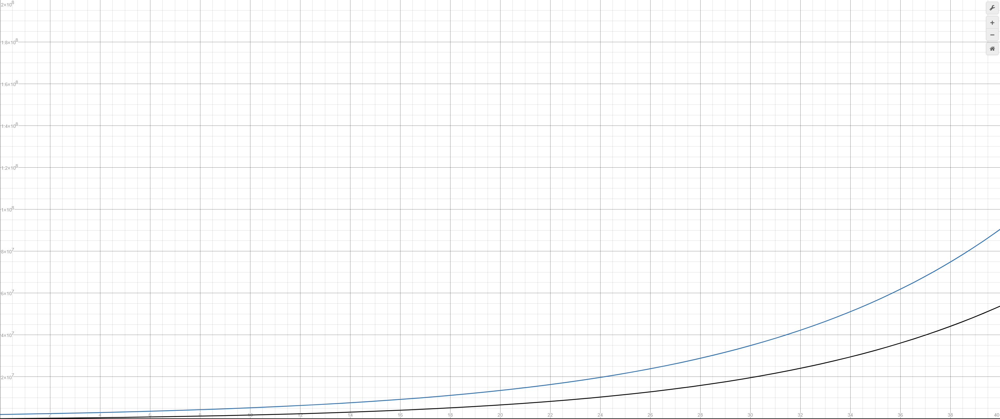

# The Power of Compounding
Compounding is the 8th wonder of the world. The only other wonder being that the majority of people start with $0 if they are lucky (lots of people start off with student debt). For someone starting with $0, it would be impossible to catch up with someone already with $2 million compounding at 10% annually. Even if they have a high paying job making $200,000 and keeping $100,000 growing at 2% a year, the difference is shown below:

The gap gets wider and wider, even when they invest that money into the market. Now imagine all the people with more than $2 million, unless someone wins the lottery (starting a business is a lottery where you fail 90% of the time), this difference will never be covered. Even if you suppose your wage grows at 10%, the same as capital, since the millionaire started at 2 million, the gap will evermore widen even when growing at the same rate. 

#### • • •

Compounding extends more than just money as well. I believe compounding also explains the divide against the smart and dumb. When someone is raised in a constantly stable environment with food, enough learning materials, and low stress, they learn better and that rate compounds on itself. For example, if we assume (with good scientific backing) better nutrition and resources to study and read regularly increases the rate of learning by 0.1% per week, you learn 5% better a year and compounding over 10 years that’s 68% faster. Now if you compare the 2, it is night and day. This is why people of low financial standing score worse and are falling behind. 

## How did the initial capital start?

Capital often started the chest via war, plunder, slavery, colonialism, violence, then scaling via stealing surplus value and the usury fees. Banks supported empires in the early days of colonization via bonds and other instruments to fund conquest. This is an ongoing process with relevance now, but there are much more complex financial machines that turn the engines of capital nowadays. 

